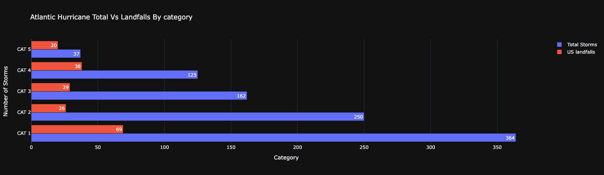

# GeospatialAnalysis_Folium
This repository contains Geospatial analysis files using python library folium to analyze hurricane tracks, landfalls and their impact over the years in US region.

Data: Atlantic hurricaner tracks and landdfall data from NOAA

Python Libraries : Folium for interactive maps.

All maps are interactive in original notebooks. Github is unable to render HTML interactive charts so I am embedding static images below.

